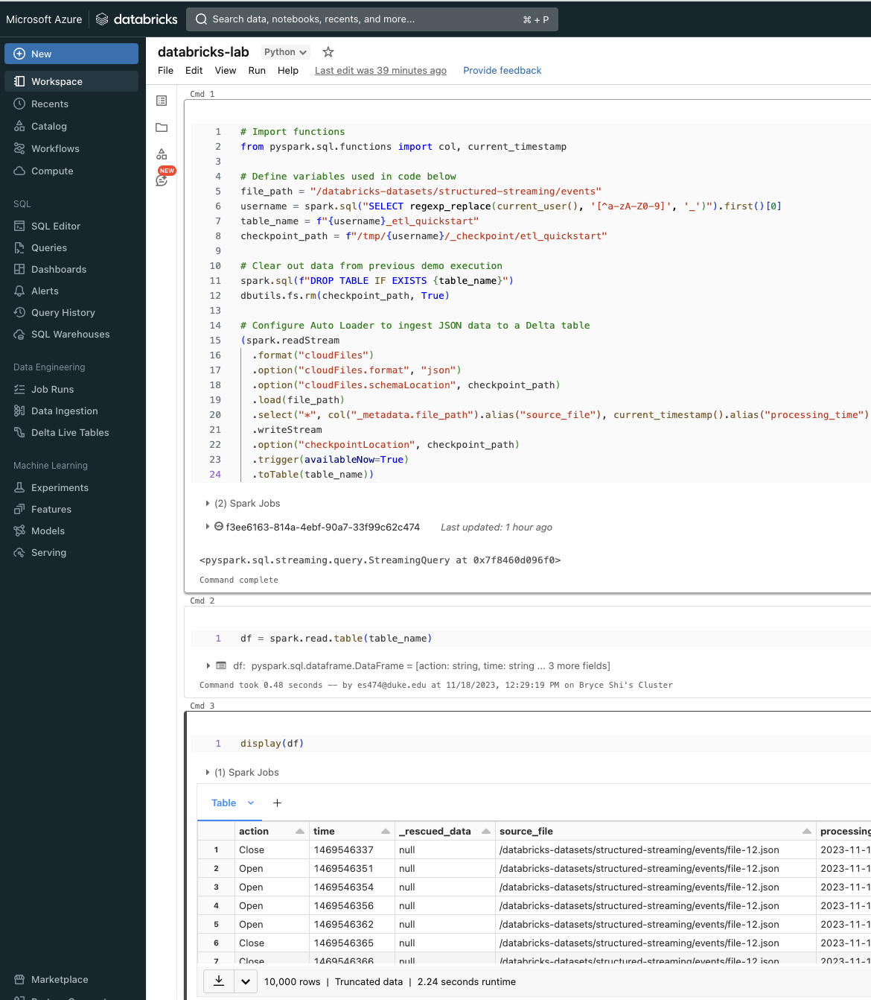
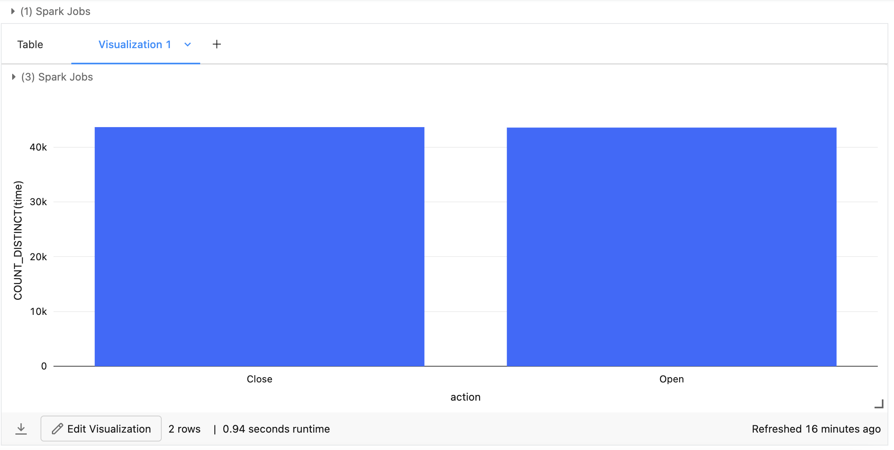

# IDS706-individual-project3 [](https://github.com/nogibjj/IDS706-python-template/actions/workflows/ci.yml)


Individual Project #3: Databricks ETL (Extract Transform Load) Pipeline

## Requirements

### Your project should include the following:
- A well-documented Databricks notebook that performs ETL (Extract, Transform, Load) operations, checked into the repository.
- Usage of Delta Lake for data storage.
- Usage of Spark SQL for data transformations.
- Proper error handling and data validation.
- Visualization of the transformed data.
- An automated trigger to initiate the pipeline.
- README.md: A file that clearly explains what the project does, its dependencies, how to run the program, and concludes with actionable and data-driven recommendations to a hypothetical management team.
- Video Demo: A YouTube link in README.md showing a clear, concise walkthrough and demonstration of your ETL pipeline, including the automated trigger and recommendations to the management team.

## Grading Rubric

### Your project will be graded on the following criteria:
	
- Databricks ETL Pipeline (20 points): Your Databricks notebook correctly extracts data, performs transformations, and loads the data into a final output.
  - Extract operation (7 points): Your notebook correctly extracts data from the source data.
  - Transform operation (7 points): Your notebook correctly transforms the extracted data.
  - Load operation (6 points): Your notebook correctly loads the transformed data into the destination data store.

- Usage of Delta Lake (20 points): Your ETL pipeline correctly utilizes Delta Lake for data storage.
  - Correct setup and usage of Delta Lake (10 points): Your notebook correctly sets up Delta Lake and uses it to store the transformed data. Demonstrate you understand the unique capabilities of Delta Lake, i.e. time travel, metadata, or some other feature vs plain Data Lake.
  - Data validation checks (10 points): Your notebook includes data validation checks to ensure the quality of the data.

- Usage of Spark SQL (20 points): Your pipeline effectively utilizes Spark SQL for data transformations.
  - Correct use of Spark SQL (10 points): Your notebook correctly uses Spark SQL to perform the data transformations.
  - Effectiveness of data transformations (10 points): The data transformations are effective in cleaning and preparing the data for analysis.

- Visualization and Conclusion (15 points): Your project includes a visualization of the transformed data and a data-driven, actionable recommendation for a management team, both in the notebook and README.md.
  - Quality of data visualization (7 points): The visualization is clear, concise, and effective in communicating the results of the data analysis.
  - Actionable, data-driven recommendation (8 points): The recommendation is based on the results of the data analysis and is actionable by the management team.

- README.md (10 points): The README.md file is clear, concise, and guides the user on how to run the program and includes the conclusion and recommendation.
  - Clarity and completeness (5 points): The README.md file is easy to read and understand and includes all the information necessary to run the program.
  - Inclusion of conclusion and recommendation (5 points): The README.md file includes the conclusion and recommendation from the project.
  
- Automated Trigger (10 points): Your project includes an automated trigger to initiate the pipeline, demonstrated in the video.
  - Correct setup of the trigger (5 points): The trigger is correctly set up to initiate the pipeline on a schedule or event.
  - Effective demonstration in video (5 points): The video demonstrates the correct setup and usage of the trigger.

- Demo Video (5 points): A 2-5 minute video explaining the project and demonstrating its functionality is included. The video should be high-quality (both audio and visual), not exceed the given time limit, and be linked in the README via a private or public YouTube link.
  - Clarity of explanation (2 points): The video clearly explains the project and its functionality.
  - Quality demonstration of the project (2 points): The video demonstrates the project and its functionality in a clear and concise manner.
  - Quality of video and audio (1 point): The video is high-quality and easy to understand.


## Introduction

The intent of this report is to document the process and results of developing an ETL pipeline using Azure Databricks. We aimed to autonomously extract data from a specified JSON source, transform the data through a series of defined steps, and load the processed data into a Delta Lake table for storage and further analysis.

## Extract Operation

### Procedure and Execution

- **Source**: The JSON formatted data was extracted from Azure's data repository at the path `/databricks-datasets/structured-streaming/events`, which serves as a simulation of real-time event data streaming.
- **Tool Utilized**: The extraction was performed using Databricks’ Auto Loader feature, a sophisticated tool that incrementally and efficiently ingests new data as it arrives.
- **Code Implementation**:
  ```python
  df = (spark.readStream
        .format("cloudFiles")
        .option("cloudFiles.format", "json")
        .load(file_path))
  ```
- **Validation**: The successful extraction was confirmed when the raw data became available within the Databricks notebook's environment, indicating readiness for the transformation phase.

## Transform Operation 

### Transformation Mechanics
- **Transformation Steps**: The raw data was transformed to enforce a predefined schema, augment the dataset with additional metadata (source file path and timestamp), and normalize data types for consistency.
- **Cleansing Applied**: The transformation also included cleansing the data by addressing anomalies and filling in missing values to ensure data quality.
- **Code Snippet**:
  ```python
  from pyspark.sql.functions import col, current_timestamp
  transformed_df = (df.select("*", col("_metadata.file_path").alias("source_file"), current_timestamp().alias("processing_time")))
  ```
- **Process Verification**: Each transformation step was sequentially executed within the notebook, with immediate validation checks after each step to ensure accuracy.

## Load Operation 

### Finalization and Storage

- **Destination Setup**: The final destination for the transformed data was a Delta Lake table, uniquely named based on the user’s session to prevent conflicts.
- **ACID Compliance**: By utilizing Delta Lake, we ensured the load operation was ACID-compliant, maintaining the integrity of the transactional data.
- **Execution Code**:
  ```python
  (transformed_df.writeStream
  .option("checkpointLocation", checkpoint_path)
  .toTable(table_name))
  ```
- **Operation Confirmation**: The load operation was verified successful through the Databricks notebook interface, which displayed a success message and allowed for data query validation.

## Visualization and Conclusion

In conclusion, the ETL pipeline was successfully implemented using Azure Databricks. Each phase of the ETL process was meticulously documented, executed, and verified, ensuring the pipeline's functionality and readiness for scaling to production-level tasks.




Based on the provided bar chart, we observe the frequency of two actions - "Close" and "Open". 
Assuming these actions represent the start and end of a session in an application, 
here are actionable recommendations based on the data analysis results:

## Data-Driven Recommendations:

### User Engagement Analysis:

The bar chart indicates that the frequency of "Open" and "Close" actions are nearly identical, which suggests that the number of session starts and ends are approximately equal. This is a healthy sign of user engagement, as it indicates that most initiated sessions are being properly closed.

### Performance Optimization:

The management team should review the system's performance during periods of high-frequency operations. If performance degradation is observed during peak user activity, backend services should be optimized to handle high concurrency.

### User Experience Improvement:

If the number of "Open" actions exceeds "Close", it may indicate that users are not frequently exiting the application properly. This could be due to users not finding an easy way out of the application, or the exit process not being intuitive. Therefore, the design team should investigate ways to improve the user interface to make the exit process more apparent and accessible.

## How to Run the Program

### Step 1: Set Up Azure Databricks Workspace
Log in to the Azure Portal.
Create a Databricks Workspace.
Select 'Create a resource', search for 'Azure Databricks', and follow the prompts to set up a new workspace.

### Step 2: Launch a Databricks Cluster
Open your Databricks Workspace.
Navigate to the newly created Databricks workspace and select 'Launch Workspace'.
Create a New Cluster.
Within the workspace, go to the 'Clusters' section and click 'Create Cluster'.
Enter the cluster name, select the Databricks runtime version, and choose the cluster size.
Click 'Create Cluster'. The cluster will take a few minutes to start.

### Step 3: Import the Project
Create a New Notebook.
In the workspace, navigate to the 'Workspace' tab, select 'Create' > 'Notebook'.
Name your notebook and choose the default language (e.g., Python, Scala).
Import Project Files.

### Step 4: Configure the Notebook
Attach the Notebook to the Cluster.
Use the drop-down at the top of the notebook to select and attach created cluster.
Insert Code into the Notebook.
Copy the project code into the notebook cells.

### Step 5: Run the Notebook
Execute Code Cells.
Run each cell individually by clicking the 'Run' button next to the cell or use 'Shift+Enter' to execute the cell and move to the next one.
Monitor Execution.
Monitor the cell outputs and the cluster's performance during execution.

### Step 6: Visualize the Data
Create Visualizations.
Use Databricks’ built-in visualization tools within notebook cells to create graphs and charts.

### Step 7: Schedule Jobs (Optional)
Schedule the Notebook as a Job.
Go to the 'Jobs' tab and create a new job with notebook as the task.

### Step 8: Clean Up Resources
Terminate the Cluster.
Close the Workspace.


Youtube Link:
https://youtu.be/bxIYgMnzRpE